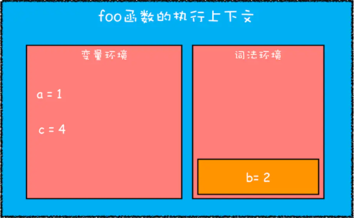
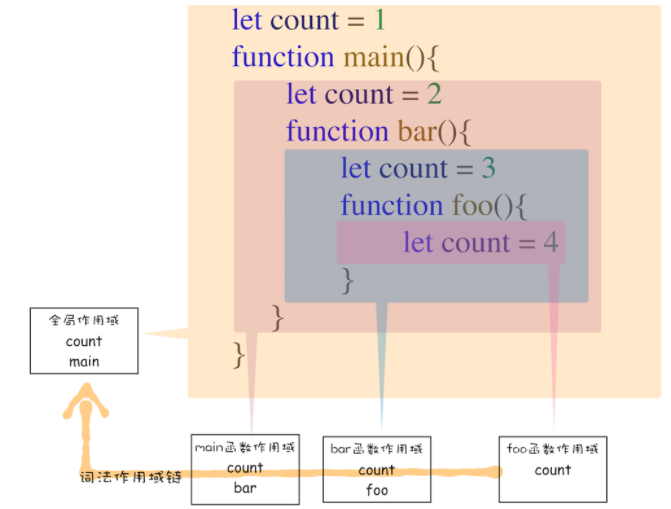

## 作用域
- 作用域是指在程序中定义变量的区域。
- 作用域决定了变量的生命周期。
- 作用域就是变量与函数的可访问范围。
- 即作用域控制着变量和函数的可见性和生命周期。

### 在ES6之前，ES的作用域只有两种：全局作用域和函数作用域。
- 全局作用域中的对象在代码中的任何地方都能访问，其生命周期伴随着页面的生命周期。
- 函数作用域就是在函数内部定义的变量或者函数，并且定义的变量或者函数只能在函数内部被访问。函数执行结束之后，函数内部定义的变量会被销毁。

### ES6 之后通过 let const 引入了块级作用域
- 只在当前代码块可见 {}
- 在块级作用域中，从开始到变量声明区间会形成一个暂时性死区，如果在这中间去访问变量，会报初始化之前不能访问变量的错误。

### JS 如何支持块级作用域的
- 存储方式
  - 在上下文对象中有一个词法环境区域。
  - 在词法环境内部，维护了一个小型栈结构。
  - 栈底是函数最外层的变量，进入一个作用域块后，就会把该作用域块内部的变量压到栈顶。
  - 当作用域执行完成之后，该作用域的信息就会从栈顶弹出，这就是词法环境的结构。
  - 这里的变量 都是 let const 声明的，var 声明的存放在变量环境中。
- 查找方式
  - 首先沿着词法环境的栈顶向下查询。
  - 如果在词法环境中的某个块中查找到了，就直接返回给JavaScript引擎。
  - 如果没有查找到，那么继续在变量环境中查找。

```js
function foo(){
    var a = 1
    let b = 2
    {
      let b = 3
      var c = 4
      console.log(a)
      console.log(b)
    }
}   
foo()
```

1. 执行 foo 函数先对其进行编译 生成上下文对象

2. 继续执行代码，当执行到代码块里面时，变量环境中a的值已经被设置成了1，词法环境中b的值已经被设置成了2

3. 再接下来，当执行到作用域块中的console.log(a)这行代码时，就需要在词法环境和变量环境中查找变量a的值了。

4. 当作用域块执行结束之后，其内部定义的变量就会从词法环境的栈顶弹出。


### 作用域链
- 在每个执行上下文的变量环境中，都包含了一个外部引用，用来指向外部的执行上下文，我们把这个外部引用称为outer。
- 当一段代码使用了一个变量时，JavaScript 引擎首先会在“当前的执行上下文”中查找该变量。
- 如果在当前的变量环境中没有查找到，那么 JavaScript 引擎会继续在 outer 所指向的执行上下文中查找。
- 我们把这个查找的链条就称为作用域链。
```js
function bar() {
    console.log(myName)
}
function foo() {
    var myName = " 极客邦 "
    bar()
}
var myName = " 极客时间 "
foo()
```


### 这个外部引用是怎么决定的 --> 词法作用域
- 在 JavaScript 执行过程中，其作用域链是由词法作用域决定的。
- 词法作用域就是指作用域是由代码中函数声明的位置来决定的，所以词法作用域是静态的作用域，通过它就能够预测代码在执行过程中如何查找标识符。
- 词法作用域就是根据代码的位置来决定的。
- 词法作用域是代码阶段就决定好的，和函数是怎么调用的没有关系。


