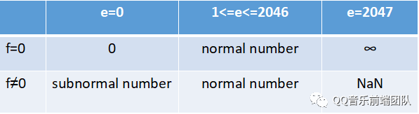

## Number

### Number 的存储标准
- JavaScript Number 采用的是 IEEE 754 定义的 64 位双精度浮点型来表示。
- 他规定 第1位是符号位 中间11位是指数位 最后52位代表尾数位 共64位
- 指数位有 11 位，取值范围是 0 到 2047。当指数位 e=0 或者 e=2047 时，根据有效数字位 f 是否为 0 ，具有不同的特殊含义，具体见下表：

- 对于常用的 normal number, 为了方便表示指数为负数的情况，所以，指数位数值大小做了一个 -1023 的偏移量。1.(...)*2^e-1023
- 对于 subnormal number,它可以用来表示更加接近于 0 的数，它特殊的地方是有效数字位的前面补充的是 0 而不是 1，且指数为偏移量是 -1022。0.(...)*2^-1022
- Number.MAX_VALUE：可表示的最大的正数，显然 e 和 f 都取最大时能表示的数最大，值为1.(...111)*2^2046-1023
- Number.MIN_VALUE：可表示的最小的正数（接近 0 ，但不是负数），用最小的 subnormal number 来表示。当 e = 0 ,f 的最后一位为 1，其他为 0 时最小，值为0.(...0001)*2^-1022
- Number.MAXSAFEINTEGER：表示在 JavaScript 中最大的安全整数。可以连续且精确被表示出来的整数成为安全整数。整数转化为二进制后，小数点后是不会有数字的，而用二进制的科学计数法表示时，小数点后最多保留 52 位，加上前置的一个 1，有 53 位数字，所以当一个数转化二进制时，如果位数超过 53 位，必然会截断末尾的部分，即导致不能精确表示，即为不安全整数。所以最小的会被截断的整数是 100...001=2^53+1（中间有52个0）。这个数设为 X，则比 X 小的整数都能被精确表示出来，再加上“连续”这个条件，所以 X-1 不是我们要的答案，X-2 才是。 Number.MAX_SAFE_INTEGER 最终值为(2^53)-1
- Number.MINSAFEINTEGER：表示在 JavaScript 中最小的安全整数，对 Number.MAX_SAFE_INTEGER 取负值即可，值为 -9007199254740991
  
### 范围 
- javascript 所有数字都保存成 64 位浮点数,这给数值的表示带来了两个限制。
- 一是数值的精度只能到 53 个二进制位(相当于 16 个十进制位),大于这个范围的整数,javascript 是无法精确表示的,这使得 javascript 不适合大规模的精确计算。
- 二是大于或等于 2 的 1024 次方的数值,javascript 无法表示,会返回 Infinity(无穷)

### 解决 
BigInt 是一种新的基本类型,用于当整数值大于 Number 数据类型的范围时.使用 BigInt 避免整数溢出,保证计算安全。

### 用科学记数法表示数
```js
var c = 156e4;
var d = 325e-3;

console.log(c, typeof(c));  // 1560000 "number"
console.log(d, typeof(d));  // 0.325 "number"
```

### 浮点数运算不精确
```js
0.55 * 100 // 55.00000000000001
0.1 + 0.2 //  0.30000000000004
```
- 计算机底层只有0 和 1， 所以所有的运算最后实际上都是二进制运算。十进制整数利用辗转相除的方法可以准确地转换为二进制数，但浮点数不能
- IEEE二进位浮点数算术标准 这个标准是JS的浮点数的实现标准 他规定 第1位是符号位 中间11位是指数位 最后52位代表尾数位 共64位
- 浮点数转换为二进制 =》 **整数部分采用除2取余，小数部分采用乘2取整**
```
0.1 转换为二进制：

0.1 * 2 -> 0.2 -> 小数位 0.2 -> 整数位 0
0.2 * 2 -> 0.4 -> 小数位 0.4 -> 整数位 0
0.4 * 2 -> 0.8 -> 小数位 0.8 -> 整数位 0
0.8 * 2 -> 1.6 -> 小数位 0.6 -> 整数位 1
0.6 * 2 -> 1.2 -> 小数位 0.2 -> 整数位 1
0.2 * 2 -> 0.4 -> 小数位 0.4 -> 整数位 0  
....
无限循环 -> 0.1 -> 0.000110011001100...
最终我们只能得到和的近似值（按照IEEE 754标准保留 52位，按 0舍1入 来取值）
```
- JS浮点数精度的缺失实际上是因为浮点数的小数部分无法用二进制很精准的转换出来，而以近似值来进行运算的话，肯定就存在精度的问题

### 怎么处理
- 浮点数的情况下会丢失精度，那我们所有运算的时候都**先将浮点数转换为整数，等计算完之后，再按比例转换会浮点数**，这样就避免了再二进制十进制转换的时候计算机的精度问题。
- 浮点数相乘时也会丢失经度，所以不能通过乘法将他转成整数。
```js
const add = (n1, n2) => {
    let pow = Math.max(n1.toString().split(".")[1].length, n2.toString().split(".")[1].length)
    let base = Math.pow(10, pow)
    n1 = n1.toString().split(".")[1]
    while(pow > n1.length){
      n1 += '0'
    }
    n2 = n2.toString().split(".")[1]
    while(pow > n2.length){
      n2 += '0'
    }
    // +  (Number(n1) + Number(n2)) / (base)
    // -  (Number(n1) - Number(n2)) / (base)
    // *  (Number(n1) * Number(n2)) / (base*base)
    // /  (Number(n1) / Number(n2))
    return (Number(n1) + Number(n2)) / (base)
}
```