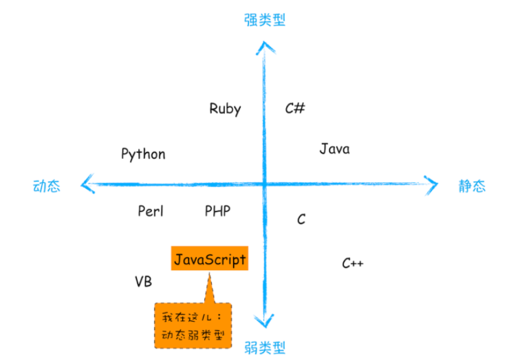
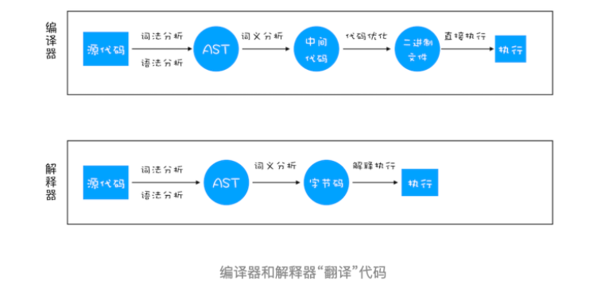

## 静态类型 动态类型
- 声明变量前需要先定义变量类型 属于静态类型语言
- 运行过程中需要检查数据类型的语言称为动态语言

## 强类型 弱类型
- 在代码执行过程中会产生隐式类型转换 弱类型
- 不支持隐式类型转换 强类型

## 编译型语言和解释型语言
- 编译型语言在程序执行之前，需要经过编译器的编译过程，并且编译之后会直接保留机器能读懂的二进制文件，这样每次运行程序时，都可以直接运行该二进制文件，而不需要再次重新编译了。
- 解释型语言编写的程序，在每次运行时都需要通过解释器对程序进行动态解释和执行。
