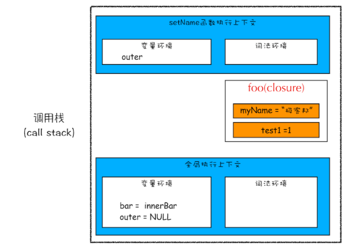

## 闭包

定义：**在另一个作用域中调用了一个函数返回的内部函数，且内部函数引用了外部函数作用域中的变量，这就形成了闭包。**

本质：**在 JavaScript 中，根据词法作用域的规则，内部函数总是可以访问其外部函数中声明的变量，当通过调用一个外部函数返回一个内部函数后，即使该外部函数已经执行结束了，但是内部函数引用外部函数的变量依然保存在内存中，我们就把这些变量的集合称为闭包。**

作用：
  1. 可以读取函数内部的变量
  2. 让这些变量的值始终保持在内存中

注意：由于闭包会使得函数中的变量都被保存在内存中，内存消耗很大，所以不能滥用闭包，否则会造成网页的性能问题，在IE中可能导致内存泄露。
解决方法是，在退出函数之前，将不使用的局部变量全部删除。

```js
function foo() {
    var myName = " 极客时间 "
    let test1 = 1
    const test2 = 2
    var innerBar = {
        getName:function(){
            console.log(test1)
            return myName
        },
        setName:function(newName){
            myName = newName
        }
    }
    return innerBar
}
var bar = foo()
bar.setName(" 极客邦 ")
bar.getName()
console.log(bar.getName())
```
