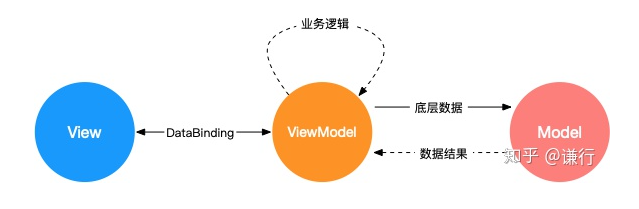

```html
<div>
    <span id="container">0</span>
  <button id="btn" onclick="javascript:add()">+</button>
</div>

<script>
  function add (){
    const container = document.getElementById('container');
    const current = parseInt(container.innerText);
    container.innerText = current + 1;
  }
</script>
```
- 视图渲染和数据处理的逻辑杂糅在一起，随着业务逻辑变复杂，代码将失控，难以维护。
- 为了解决这些问题，出现了 MVC MVP MVVM 等web设计模式，通过关注点分离来改进代码的组织方式
  
## MVC
Model：模型层，数据相关的操作
View：视图层，用户界面渲染逻辑
Controller：控制器，数据模型和视图之间通信的桥梁


```js
// view
<div>
    <span id="container">0</span>
  <button id="btn">+</button>
</div>

// model
function add (node) {
  // 业务逻辑处理
  const currentValue = parseInt(node.innerText);
  const newValue = currentValue + 1;

  // 更新视图
    node.innerText = current + 1;
}

// controller
const button = document.getElementById('btn');
// 响应视图指令
button.addEventListener('click', () => {
  const container = document.getElementById('container');

  // 调用模型
    add(container);
}, false);
```
- controller 作为桥梁，与 view 层存在一定的耦合。
- 但是 view 的更新由 model 负责，model 与 view 的耦合是我们不想接受的一件事情，于是出现了MVP模式。

## MVP 
Model：和具体业务无关的数据处理
View：用户界面渲染逻辑
Presenter：响应视图指令，同时进行相关业务处理，必要时候获调用 Model 获取底层数据，返回指令结果到视图，驱动视图渲染


- MVP 模式相对于 MVC 有几个核心变化
- View 和 Model 完全隔离，Model 不再负责业务逻辑和视图变化，只负责底层数据处理
- Presenter 接管路由和业务逻辑，但要求 View 实现 View Interface，方便和具体 View 解耦，可以不依赖 UI 进行单元测试
- View 层只负责发起指令和根据数据渲染 UI，不再有主动监听数据变化等行为，所以也被称之为被动视图

```js
// view 
<div>
    <span id="container">0</span>
  <button id="btn">+</button>
</div>
<script>
    // View Interface
    const globalConfig = {
    containerId: 'container',
    buttonId: 'btn',
  };
</script>

// model 
function add (num) {
  return num + 1;
}

// presenter
const button = document.getElementById(globalConfig.containerId);
const container = document.getElementById(globalConfig.buttonId);

// 响应视图指令
button.addEventListener('click', () => {
  const currentValue = parseInt(container.innerText);
  // 调用模型
    const newValue = add(currentValue);
  // 更新视图
  container.innerText = current + 1;
}, false);
```

## MVVM
View 和 Model 职责和 MVP 相同
ViewModel 主要靠 DataBinding 把 View 和 Model 做了自动关联，框架替应用开发者实现数据变化后的视图更新，相当于简化了 Presenter 的部分功能


```js
<div id="test">
  <!-- 数据和视图绑定 -->
    <span>{{counter}}</span>
  <button v-on:click="counterPlus">+</button>
</div>

function add (num) {
  return num + 1;
}

new Vue({
  el: '#test',
  data: {
    counter: 0
  },
  methods: {
    counterPlus: function () {
        // 只需要修改数据，无需手工修改视图
        this.counter = add(this.counter);
    }
  }
})
```

## 总结
MVC 对视图和数据做了第一步的分离，实现简单，但 View、业务逻辑、底层数据模型 分离的不彻底
MVP 通过 Presenter 彻底解耦了 View 和 Model，同时剥离了业务逻辑和底层数据逻辑，让 Model 变得稳定，但业务逻辑复杂情况下 Presenter 会相对臃肿
MVVM 通过 DataBinding 实现了视图和数据的绑定，但依赖框架实现，增加了理解成本，在错误使用的情况下调试复杂