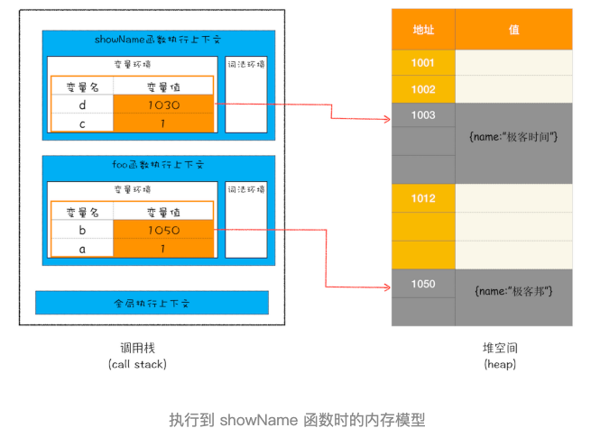

## 回收栈内存数据
```js
function foo(){
    var a = 1
    var b = {name:" 极客邦 "}
    function showName(){
      var c = " 极客时间 "
      var d = {name:" 极客时间 "}
    }
    showName()
}
foo()
```
- 执行 showName 时的调用栈情况


- 栈内存的销毁，靠一个记录执行状态的指针，叫做 ESP
- 当showName执行完毕 ESP指针会下移

- 当foo再次调用其他函数时，上下文入栈会直接覆盖掉无效内存

## 回收堆内存数据
