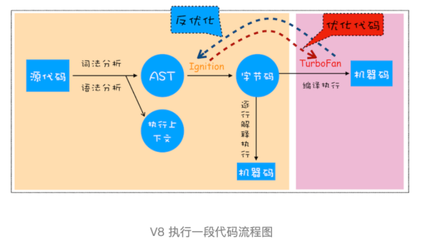
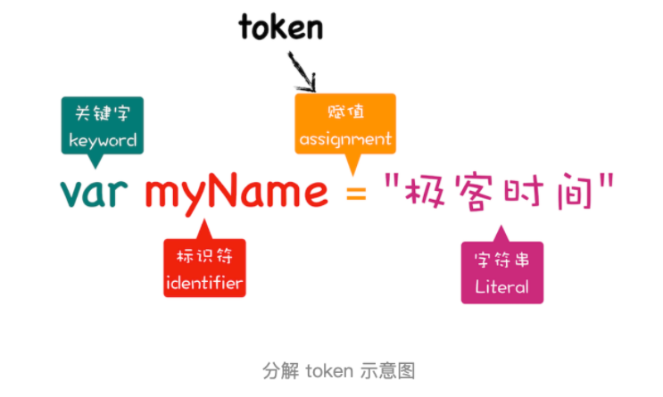

## 流程图

1. 生成抽象语法树（AST）和执行上下文
    - AST 语法树，一种代码的结构化表示的数据类型，为了让机器能够理解我们的代码。
    - 第一阶段是分词（tokenize），又称为词法分析，其作用是将一行行的源码拆解成一个个 token。所谓token，指的是语法上不可能再分的、最小的单个字符或字符串。
    - 
    - 从图中可以看出，通过var myName = “极客时间”简单地定义了一个变量，其中关键字“var”、标识符“myName” 、赋值运算符“=”、字符串“极客时间”四个都是 token，而且它们代表的属性还不一样。
    - 第二阶段是解析（parse），又称为语法分析，其作用是将上一步生成的 token 数据，根据语法规则转为 AST。如果源码符合语法规则，这一步就会顺利完成。但如果源码存在语法错误，这一步就会终止，并抛出一个“语法错误”。
2. 有了 AST 后，那接下来 V8 就会生成该段代码的执行上下文。
3. 生成字节码，解释器 Ignition，会根据 AST 生成字节码，并解释执行字节码。
4. 其实一开始 V8 并没有字节码，而是直接将 AST 转换为机器码，由于执行机器码的效率是非常高效的，所以这种方式在发布后的一段时间内运行效果是非常好的。
5. 可是 V8 需要消耗大量的内存来存放转换后的机器码。为了解决内存占用问题，V8 团队大幅重构了引擎架构，引入字节码，并且抛弃了之前的编译器。
6. 字节码就是介于 AST 和机器码之间的一种代码，字节码占据内存小于机器码。字节码需要通过解释器将其转换为机器码后才能执行。
7. 执行代码，生成字节码之后，接下来就要进入执行阶段了。
8. 第一次执行的字节码，解释器 Ignition 会逐条解释执行。
9. 在执行字节码的过程中，如果发现有热点代码（HotSpot），比如一段代码被重复执行多次，这种就称为热点代码。
10. 那么后台的编译器 TurboFan 就会把该段热点的字节码编译为高效的机器码，然后当再次执行这段被优化的代码时，只需要执行编译后的机器码就可以了，这样就大大提升了代码的执行效率。
11. 这种技术称为即时编译。