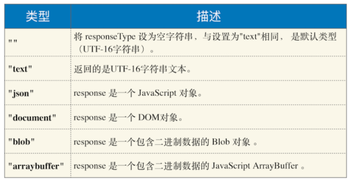
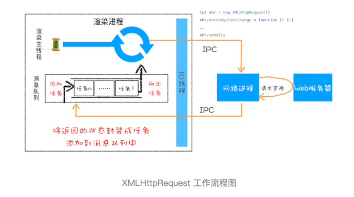

```js
function GetWebData(URL){
    /**
     * 1: 新建 XMLHttpRequest 请求对象
     */
    let xhr = new XMLHttpRequest()
 
    /**
     * 2: 注册相关事件回调处理函数 
     */
    xhr.onreadystatechange = function () {
        switch(xhr.readyState){
          case 0: // 请求未初始化
            console.log(" 请求未初始化 ")
            break;
          case 1://OPENED
            console.log("OPENED")
            break;
          case 2://HEADERS_RECEIVED
            console.log("HEADERS_RECEIVED")
            break;
          case 3://LOADING  
            console.log("LOADING")
            break;
          case 4://DONE
            if(this.status == 200||this.status == 304){
                console.log(this.responseText);
                }
            console.log("DONE")
            break;
        }
    }
 
    xhr.ontimeout = function(e) { console.log('ontimeout') }
    xhr.onerror = function(e) { console.log('onerror') }
 
    /**
     * 3: 打开请求
     */
    xhr.open('Get', URL, true);// 创建一个 Get 请求, 采用异步
 
 
    /**
     * 4: 配置参数
     */
    xhr.timeout = 3000 // 设置 xhr 请求的超时时间
    xhr.responseType = "text" // 设置响应返回的数据格式
    xhr.setRequestHeader("X_TEST","time.geekbang")
 
    /**
     * 5: 发送请求
     */
    xhr.send();
}
```

## 执行过程
1. 创建 XMLHttpRequest 对象。
2. 为 xhr 对象注册回调函数。
   1. 因为网络请求比较耗时，所以要注册回调函数，这样后台任务执行完成之后就会通过调用回调函数来告诉其执行结果。
   2. ontimeout，用来监控超时请求，如果后台请求超时了，该函数会被调用； 
   3. onerror，用来监控出错信息，如果后台请求出错了，该函数会被调用； 
   4. onreadystatechange，用来监控后台请求过程中的状态，比如可以监控到 HTTP 头加载完成的消息、HTTP 响应体消息以及数据加载完成的消息等。
3. 配置基础的请求信息。
   1. 首先通过 open 接口配置一些基础的请求信息，包括请求的地址、请求方法（是 get 还是 post）和请求方式（同步还是异步请求）。
   2. 然后通过 xhr 内部属性类配置一些其他可选的请求信息。
      1. xhr.timeout = 3000来配置超时时间
      2. xhr.responseType = "text"来配置服务器返回的格式
      3. 
4. xhr.setRequestHeader 设置请求头
5. 发起请求。
   1. 调用xhr.send来发起网络请求
   2. 渲染进程会将请求发送给网络进程，然后网络进程负责资源的下载。
   3. 等网络进程接收到数据之后，就会利用 IPC 来通知渲染进程。
   4. 渲染进程接收到消息之后，会将 xhr 的回调函数封装成任务并添加到消息队列中。
   5. 等主线程循环系统执行到该任务的时候，就会根据相关的状态来调用对应的回调函数
   6. 如果网络请求出错了，就会执行 xhr.onerror；
   7. 如果超时了，就会执行 xhr.ontimeout；
   8. 如果是正常的数据接收，就会执行 onreadystatechange 来反馈相应的状态。


## 注意事项
- 跨域问题，协议、域名、端口不一致，就无法通过 XMLHttpRequest 请求数据，这就产生了跨域问题。
- 在 HTTPS 站点中使用 XMLHttpRequest 请求 http 站点下的资源，请求会报错