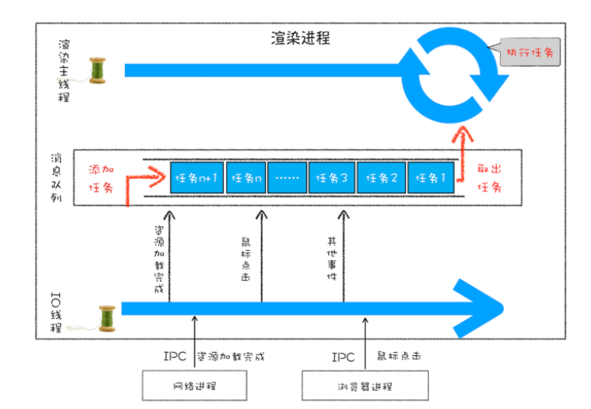

## 事件循环
- 页面渲染由渲染进程的渲染主线程负责，他是一个循环执行的线程，会不断的从消息队列中取出任务执行。
- 消息队列用于存储下一步要执行的任务。
- IO 线程用来接受其他进程传递的消息，它会将这些消息组装成任务添加到消息队列中。

## 消息队列中的任务类型
- 输入事件（鼠标滚动、点击、移动）
- 渲染事件（如解析 DOM、计算布局、绘制）
- JavaScript 执行
- 网络请求完成、文件读写完成事件。
  
- 当接收到 HTML 文档数据，渲染引擎就会将“解析 DOM”事件添加到消息队列中。
- 当用户改变了 Web 页面的窗口大小，渲染引擎就会将“重新布局”的事件添加到消息队列中。
- 当触发了 JavaScript 引擎垃圾回收机制，渲染引擎会将“垃圾回收”任务添加到消息队列中。
- 同样，如果要执行一段异步 JavaScript 代码，也是需要将执行任务添加到消息队列中。
  
## 渲染主线程如何退出
1. 设置一个突出线程的变量
2. 每执行完一个任务，检查变量
3. 变量为真 退出线程
   
## 单线程存在的问题
- 如何处理高优先级的任务
  - 消息队列中的任务只能从头部开始一个一个向后执行，高优先级任务无法得到快速响应。
  - 针对这种情况，微任务就应用而生。
  - 消息队列中的任务称为宏任务，每个宏任务中都包含了一个微任务队列。
  - 在执行宏任务的过程中，如果微任务产生，就将微任务添加到微任务列表中，例如 mutationObserve监听DOM 变化、Promise.then。
  - 等宏任务中的主要功能都直接完成之后，渲染引擎并不着急去执行下一个宏任务，而是执行当前宏任务中的微任务。
  - 这样高优先级任务添加到微任务队列中就可以得到快速响应。

## setTimeout
- setTimeout 任务不是添加到消息队列中，因为消息队列无法保证该任务在指定时间内运行。
- 在 Chrome 中除了消息队列，还有一个延迟队列，当使用setTimeout创建任务时，渲染主线程会将该任务注册到延迟队列中。
- 这个回调任务包含了回调函数名，当前发起时间，以及延迟执行时间。
- 当每处理完消息队列中的一个任务后都会到延迟任务队列中找到到期的任务执行。

## setTimeout 注意事项
1. 定时器任务不一定按照预期时间执行。定时器任务会在当前消息队列任务执行完毕时再去判断执行，如果当前任务耗时很久，会延迟定时器任务执行。
2. 如果 setTimeout 存在嵌套调用，那么系统会设置最短时间间隔为 4 毫秒。
   - 在 Chrome 中，定时器被嵌套调用 5 次以上，系统会判断该函数方法被阻塞了，如果定时器的调用时间间隔小于 4 毫秒，那么浏览器会将每次调用的时间间隔设置为 4 毫秒。
   - 所以，一些实时性较高的需求就不太适合使用 setTimeout 了，比如你用 setTimeout 来实现 JavaScript 动画就不是一个很好的主意。
3. 未激活的页面，setTimeout 执行最小间隔是 1000 毫秒
   - 未被激活的页面中定时器最小值大于 1000 毫秒。
   - 目的是为了优化后台页面的加载损耗以及降低耗电量。
4. 延时执行时间有最大值
   - Chrome、Safari、Firefox 都是以 32 个 bit 来存储延时值的，32bit 最大只能存放的数字是 2147483647 毫秒。
   - 这就意味着，如果 setTimeout 设置的延迟值大于 2147483647 毫秒（大约 24.8 天）时就会溢出，这导致定时器会被立即执行。