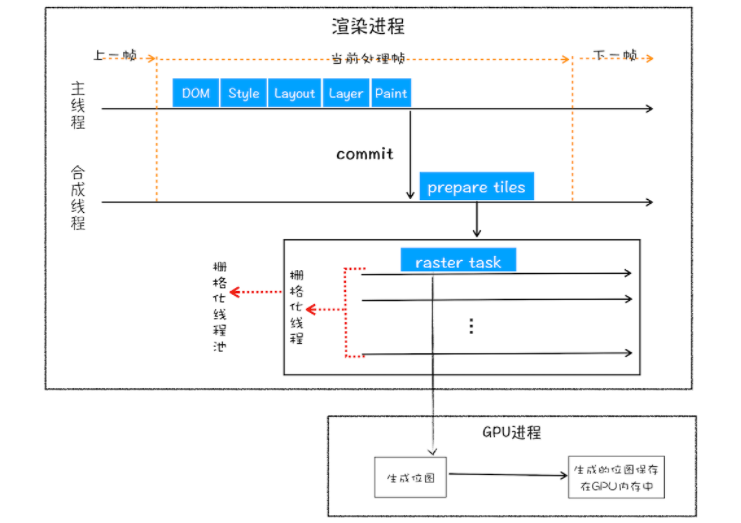

## 进程通信阶段
1. 网络进程收到响应之后，解析响应头，如果是text/html，就通知浏览器进程准备进行渲染。
2. 浏览器进程开始准备渲染进程，然后浏览器进程会发起‘提交文档’命令给渲染进程。
3. 渲染进程收到命令后跟网络进程建立传输通道，网络进程以字节流的方式将 html 转递给渲染进程。
4. 渲染进程边接受字节流边进行 html 解析工作。

## 渲染阶段，按照渲染的时间顺序，流水线可分为如下几个子阶段：
- 构建DOM树、样式计算、布局阶段、分层、绘制、分块、光栅化和合成。

## HTML 解析
1. 词法分析阶段，将 HTML 字节流转换为 Token。
2. 
3. 将 Token 解析为 DOM 节点，并将 DOM 节点添加到 DOM 树中。
4. HTML 解析器维护了一个Token 栈结构，该 Token 栈主要用来计算节点之间的父子关系。
5. 如果压入到栈中的是StartTag Token，HTML 解析器会为该 Token 创建一个 DOM 节点，然后将该节点加入到 DOM 树中，它的父节点就是栈中相邻的那个元素生成的节点。
6. 如果分词器解析出来是文本 Token，那么会生成一个文本节点，然后将该节点加入到 DOM 树中，文本 Token 是不需要压入到栈中，它的父节点就是当前栈顶 Token 所对应的 DOM 节点。
7. 如果分词器解析出来的是EndTag 标签，比如是 EndTag div，HTML 解析器会查看 Token 栈顶的元素是否是 StarTag div，如果是，就将 StartTag div 从栈中弹出，表示该 div 元素解析完成。
8. 通过分词器产生的新 Token 就这样不停地压栈和出栈，整个解析过程就这样一直持续下去，直到分词器将所有字节流分词完成。

### 预解析
- 渲染进程接收 HTML 文件字节流时，会先开启一个预解析线程，如果遇到 JavaScript 文件或者 CSS 文件，那么预解析线程会提前下载这些数据。

## JS 解析
- 内嵌 js 脚本，解析到script标签时，渲染引擎判断这是一段脚本，此时 HTML 解析器就会暂停 DOM 的解析，执行js脚本。因为接下来的 JavaScript 可能要修改当前已经生成的 DOM 结构。
- 引入 js 文件，执行到 JavaScript 标签时，暂停整个 DOM 的解析，先下载这段 JavaScript 代码，文件的下载过程会阻塞 DOM 解析
- 执行 js 脚本之前，js 可能会操作 css 样式，所以渲染线程还会等待css文件下载完成并解析生成cssom对象之后在执行脚本。
  
## CSS 解析
1. 将 CSS 字节流转换为渲染引擎可以理解的 stylesheet 数据结构，两个作用，供 js 操作样式表，为布局树的合成提供样式信息。
2. 属性值的标准化，将单位同一。
3. 根据 CSS 的继承规则和层叠规则，计算出 Dom 树每个节点的样式属性，并保存在 ComputedStyle 的结构内。

## 布局
- 创建布局树，遍历DOM树中的所有可见节点，并把这些节点加到布局中。
- 而不可见的节点会被布局树忽略掉。
- 如head标签下面的全部内容。
- 再比如body.p.span这个元素，因为它的属性包含 dispaly:none。
- 这些元素没有被包进布局树。
- 生成布局树之后，计算布局树节点的坐标位置。

## 分层
- 为了实现更复杂的页面效果，比如3D变换、页面滚动，或者使用z-indexing做z轴排序等。
- 生成布局树之后，渲染引擎还需要为特定的节点生成专用的图层，并生成一棵对应的图层树（LayerTree）。
- 拥有层叠上下文属性的元素会被提升为单独的一层。position z-index opacity等。
-  需要剪裁（clip）的地方也会被创建为图层。超出容器宽高的元素。
- 层树是渲染流水线后续流程的基础结构。
- 层树中的每个节点都对应着一个图层，下一步的绘制阶段就依赖于层树中的节点。

## 绘制
- 渲染引擎实现图层的绘制，会把一个图层的绘制拆分成很多小的绘制指令，然后再把这些指令按照顺序组成一个待绘制列表。
- 绘制列表中的指令其实非常简单，就是让其执行一个简单的绘制操作，比如绘制粉色矩形或者黑色的线等。
- 在图层绘制阶段，最终的输出内容就是这些待绘制列表。

## 分块
- 当图层的绘制列表准备好之后，主线程会把该绘制列表提交（commit）给合成线程，合成线程会将图层划分为图块。
- 通常情况下，页面的内容都要比屏幕大得多，显示一个页面时，如果等待所有的图层都生成完毕，再进行合成的话，会产生一些不必要的开销，也会让合成图片的时间变得更久。
- 因此，合成线程会将每个图层分割为大小固定的图块，然后优先绘制靠近视口的图块，这样就可以大大加速页面的显示速度。

## 光栅化
- 光栅化就是按照绘制列表中的指令生成图片。
- 每一个图快都对应一张图片。
- 渲染进程维护了一个栅格化的线程池，所有的图块栅格化都是在线程池内执行的。
- 栅格化过程都会使用GPU来加速生成，使用GPU生成位图的过程叫快速栅格化，或者GPU栅格化，生成的图片被保存在GPU内存中。

## 合成
- 光栅化之后，合成线程会将生成的图片合成为一张。
- 并最终将生成的图片发送到显卡的缓冲区。
- 最后向浏览器进程发送绘制图块的命令。
- 浏览器进程接收合成线程发过来的命令，最终将图片显示在屏幕上。

## 优化
- 当需要对某个元素做几何形状变换、透明度变换或者一些缩放操作。
- 如果使用 JavaScript 来写这些效果，会牵涉到整个渲染流水线，所以 JavaScript 的绘制效率会非常低下。
- 尽可能使用 css 动画处理，因为 css 动画是在合成线程上进行的不会阻塞渲染主线程，同时也避免了样式计算，重新布局的时间。

## 页面加载阶段优化
1. 加载阶段，是指从发出请求到渲染出完整页面的过程，影响到这个阶段的主要因素有网络和 JavaScript 脚本。
2. 按照渲染流水线，我们知道影响加载的只有 JavaScript、首次请求的 HTML 资源文件、CSS 文件资源。  
3. 因为在构建 DOM 的过程中需要 HTML 和 JavaScript 文件，在构造渲染树的过程中需要用到 CSS 文件。
4. 并且 js 脚本的执行也需要用到解析后的 cssom
5. 这些能阻塞网页首次渲染的资源称为关键资源。
6. 第一个是关键资源个数。关键资源个数越多，首次页面的加载时间就会越长。
   1. 将 JavaScript 和 CSS 改成内联的形式，较少关键资源下载个数。
   2. 如果 JavaScript 代码没有 DOM 或者 CSSOM 的操作，则可以改成 sync 或者 defer 属性，将其变成非关键资源。
7. 第二个是关键资源大小。
   1. 压缩 CSS 和 JavaScript 资源
   2. 移除 HTML、CSS、JavaScript 文件中一些注释内容

## 交互阶段优化
1. 大部分情况下，生成一个新的帧都是由 JavaScript 通过修改 DOM 或者 CSSOM 来触发的。还有另外一部分帧是由 CSS 来触发的。
2. 如果在计算样式阶段发现有布局信息的修改，那么就会触发重排操作，然后触发后续渲染流水线的一系列操作，这个代价是非常大的。
3. 如果在计算样式阶段没有发现有布局信息的修改，只修改了颜色一类的信息，那么可以跳过布局阶段，直接进入绘制阶段，这个过程叫重绘。不过重绘阶段的代价也是不小的。
4. 另外一种情况，通过 CSS 实现一些变形、渐变、动画等特效，这是由 CSS 触发的，并且是在合成线程上执行的，这个过程称为合成。因为它不会触发重排或者重绘，而且合成操作本身的速度就非常快，所以执行合成是效率最高的方式。

5. 减少 JavaScript 脚本执行时间，避免长时间占据渲染主线程。
   1. 一种是将一次执行的函数分解为多个任务，使得每次的执行时间不要过久。 fiber
   2. 另一种是采用 Web Workers。不过 Web Workers 中没有 DOM、CSSOM 环境。
6. 避免强制同步布局
   1. 正常情况下的布局操作，通过 DOM 接口执行添加元素或者删除元素等操作后，是需要重新计算样式和布局的，不过正常情况下这些操作都是在另外的任务中异步完成的，这样做是为了避免当前的任务占用太长的主线程时间。
   2. 强制同步布局，是指 JavaScript 强制将计算样式和布局操作提前到当前的任务中。
      1. 修改 DOM 结构后再去查询一些相关的 DOM 信息，这样会导致强制同步布局。
      2. js 会强制让浏览器将新计算样式和布局的任务执行
7. 合理利用 CSS 合成动画
   1. 合成动画是直接在合成线程上执行的，快速高效，不阻塞主线程。
8. 避免频繁的垃圾回收
   1. 频繁的创建临时对象也会导致频繁的GC。
   2. GC 也会阻塞主线程执行，导致页面卡顿。