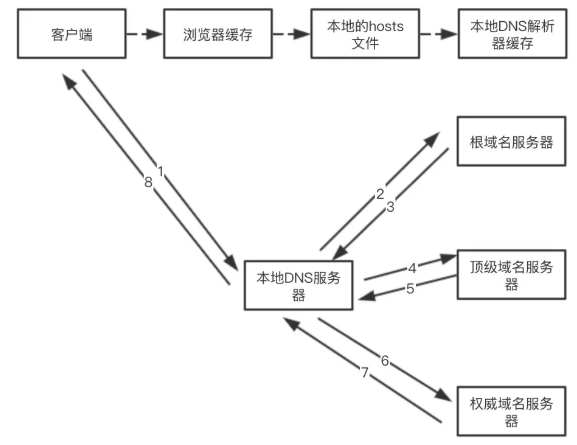

## 浏览器输入URL后发生了什么？

1. 判断用户输入内容
   1. 如果是搜索内容，地址栏会使用浏览器默认的搜索引擎，来合成新的带搜索关键字的URL。
   2. 如果判断输入内容符合URL规则，那么地址栏会根据规则，把这段内容加上协议，合成为完整的URL。
   3. 进行 URL 解析也就是对 URL 进行编码 [详解](URL编码.md)
2. URL 请求过程，浏览器进程会通过进程间通信（IPC）把URL请求发送至网络进程，网络进程接收到URL请求后，会在这里发起真正的URL请求流程。
3. 首先，网络进程会查找本地缓存是否缓存了该资源。如果有缓存资源，那么直接返回资源给浏览器进程。
4. 没有查找到资源，那么直接进入网络请求流程。
5. 第一步是要进行**DNS 域名解析**，以获取请求域名的服务器IP地址。如果请求协议是HTTPS，那么还需要建立TLS连接。
   1.  该服务具有高可用高并发分布式的特点。分为三个等级的服务器，根级 DNS 服务器，顶级域 DNS 服务器，权威 DNS 服务器。
   2.  
6. 接下来就是利用IP地址和服务器通过三次握手建立TCP连接。
   1. 等待 TCP 队列，Chrome有个机制，同一个域名同时最多只能建立6个TCP连接，超出的请求会进入排队等待状态，直至进行中的请求完成。
   2. 三次握手的目的是为了防止已经失效的连接请求突然又传送到服务端，因而产生错误。
   3. 第一次握手：建立连接。客户端发送连接请求报文段，将SYN位置为1，Sequence Number为x；然后，客户端进入SYN_SEND状态，等待服务器的确认；
   4. 第二次握手：服务器收到SYN报文段。服务器收到客户端的SYN报文段，需要对这个SYN报文段进行确认，设置Acknowledgment Number为x+1(Sequence Number+1)；同时，自己还要发送SYN请求信息，将SYN位置为1，Sequence Number为y；服务器端将上述所有信息放到一个报文段（即SYN+ACK报文段）中，一并发送给客户端，此时服务器进入SYN_RECV状态；
   5. 第三次握手：客户端收到服务器的SYN+ACK报文段。然后将Acknowledgment Number设置为y+1，向服务器发送ACK报文段，这个报文段发送完毕以后，客户端和服务器端都进入ESTABLISHED状态，完成TCP三次握手。  
7. 连接建立之后，浏览器端会构建请求行、请求头等信息，然后向服务器发送构建的请求信息。
8. 服务器接收到请求信息后，会根据请求信息生成响应数据（包括响应行、响应头和响应体等信息），等网络进程接收了响应行和响应头之后，就开始解析响应头的内容了。
   1. 重定向，如果发现返回响应头的状态码是301或者302，说明服务器需要浏览器重定向到其他URL。这时网络进程会从响应头的Location字段里面读取重定向的地址，然后再发起新的HTTP或者HTTPS请求，一切又重头开始了。
   2. 返回的响应头的状态码是200，这是告诉浏览器一切正常，可以继续往下处理请求。
   3. 响应数据类型处理，通过响应头Content-Type字段分析接受的数据类型
      1. 字节流类型，该请求会被提交给浏览器的下载管理器，同时该URL请求的导航流程就此结束。
      2. 如果是HTML，浏览器则会继续进行导航流程，由于Chrome的页面渲染是运行在渲染进程中的，所以接下来就需要准备渲染进程了。
9.  准备渲染进程，默认情况下，Chrome会为每个页面分配一个渲染进程，也就是说，每打开一个新页面就会配套创建一个新的渲染进程。
10. 如果从A页面打开B页面，且A和B都属于同一站点的话，那么B页面复用A页面的渲染进程。根域名跟协议一致即为同一站点。
11. 渲染进程准备好之后，开始进行文档提交（响应体中的数据），将网络进程中的数据传输给渲染进程。
12. “提交文档”的消息是由浏览器进程发出的，渲染进程接收到“提交文档”的消息后，会和网络进程建立传输数据的“管道”。
13. [渲染流程](./浏览器渲染流程.md)
14. 等文档数据传输完成之后，渲染进程会返回“确认提交”的消息给浏览器进程。
15. 浏览器进程在收到“确认提交”的消息后，会更新浏览器界面状态，包括了安全状态、地址栏的URL、前进后退的历史状态，并更新Web页面。