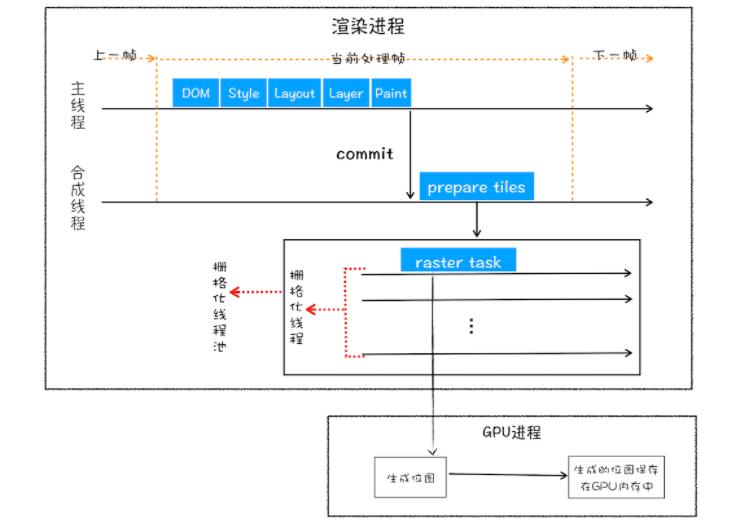

## 浏览器输入URL后发生了什么？
  **流程：**

  1. 用户输入
  2. URL 请求过程
  3. TCP 连接
  4. 发送请求
  5. 接受响应
  6. 渲染页面
  7. 断开连接
   
  **解析：**

  1. 判断用户输入内容
     1. 如果是搜索内容，地址栏会使用浏览器默认的搜索引擎，来合成新的带搜索关键字的URL。
     2. 如果判断输入内容符合URL规则，那么地址栏会根据规则，把这段内容加上协议，合成为完整的URL。
     3. 进行 URL 解析也就是对 URL 进行编码 [详解](URL编码.md)
  2. URL 请求过程，浏览器进程会通过进程间通信（IPC）把URL请求发送至网络进程，网络进程接收到URL请求后，会在这里发起真正的URL请求流程。
  3. 首先，网络进程会查找本地缓存是否缓存了该资源。如果有缓存资源，那么直接返回资源给浏览器进程。
  4. 没有查找到资源，那么直接进入网络请求流程。
  5. 第一步是要进行**DNS 域名解析**，以获取请求域名的服务器IP地址。如果请求协议是HTTPS，那么还需要建立TLS连接。
     1.  该服务具有高可用高并发分布式的特点。分为三个等级的服务器，根级 DNS 服务器，顶级域 DNS 服务器，权威 DNS 服务器。
     2.  
  6. 接下来就是利用IP地址和服务器通过三次握手建立TCP连接。
     1. 等待 TCP 队列，Chrome有个机制，同一个域名同时最多只能建立6个TCP连接，超出的请求会进入排队等待状态，直至进行中的请求完成。
     2. 三次握手的目的是为了防止已经失效的连接请求突然又传送到服务端，因而产生错误。
     3. 第一次握手：建立连接。客户端发送连接请求报文段，将SYN位置为1，Sequence Number为x；然后，客户端进入SYN_SEND状态，等待服务器的确认；
     4. 第二次握手：服务器收到SYN报文段。服务器收到客户端的SYN报文段，需要对这个SYN报文段进行确认，设置Acknowledgment Number为x+1(Sequence Number+1)；同时，自己还要发送SYN请求信息，将SYN位置为1，Sequence Number为y；服务器端将上述所有信息放到一个报文段（即SYN+ACK报文段）中，一并发送给客户端，此时服务器进入SYN_RECV状态；
     5. 第三次握手：客户端收到服务器的SYN+ACK报文段。然后将Acknowledgment Number设置为y+1，向服务器发送ACK报文段，这个报文段发送完毕以后，客户端和服务器端都进入ESTABLISHED状态，完成TCP三次握手。  
  7. 连接建立之后，浏览器端会构建请求行、请求头等信息，然后向服务器发送构建的请求信息。
  8. 服务器接收到请求信息后，会根据请求信息生成响应数据（包括响应行、响应头和响应体等信息），等网络进程接收了响应行和响应头之后，就开始解析响应头的内容了。
     1. 重定向，如果发现返回响应头的状态码是301或者302，说明服务器需要浏览器重定向到其他URL。这时网络进程会从响应头的Location字段里面读取重定向的地址，然后再发起新的HTTP或者HTTPS请求，一切又重头开始了。
     2. 返回的响应头的状态码是200，这是告诉浏览器一切正常，可以继续往下处理请求。
     3. 响应数据类型处理，通过响应头Content-Type字段分析接受的数据类型
        1. 字节流类型，该请求会被提交给浏览器的下载管理器，同时该URL请求的导航流程就此结束。
        2. 如果是HTML，浏览器则会继续进行导航流程，由于Chrome的页面渲染是运行在渲染进程中的，所以接下来就需要准备渲染进程了。
     4. 
  9.  准备渲染进程，默认情况下，Chrome会为每个页面分配一个渲染进程，也就是说，每打开一个新页面就会配套创建一个新的渲染进程。
  10. 如果从A页面打开B页面，且A和B都属于同一站点的话，那么B页面复用A页面的渲染进程。根域名跟协议一致即为同一站点。
  11. 渲染进程准备好之后，开始进行文档提交（响应体中的数据），将网络进程中的数据传输给渲染进程。
  12. “提交文档”的消息是由浏览器进程发出的，渲染进程接收到“提交文档”的消息后，会和网络进程建立传输数据的“管道”。
  13. 等文档数据传输完成之后，渲染进程会返回“确认提交”的消息给浏览器进程。
  14. 浏览器进程在收到“确认提交”的消息后，会更新浏览器界面状态，包括了安全状态、地址栏的URL、前进后退的历史状态，并更新Web页面。
  15. 渲染阶段，按照渲染的时间顺序，流水线可分为如下几个子阶段：构建DOM树、样式计算、布局阶段、分层、绘制、分块、光栅化和合成。
  16. 根据 HTML 解析器解析输出树状结构的DOM，将 HTML 代码转换成内存中的树状结构，生成 DOM 树。
  17. 解析 CSS 文本转换成浏览器可以理解的数据结构，styleSheets，操作该数据进行属性值的标准化。
  18. 根据CSS的继承规则和层叠规则，计算出 Dom 树每个节点的样式属性，并保存在ComputedStyle的结构内。
  19. 布局，创建布局树，遍历DOM树中的所有可见节点，并把这些节点加到布局中，而不可见的节点会被布局树忽略掉，如head标签下面的全部内容，再比如body.p.span这个元素，因为它的属性包含 dispaly:none，所以这个元素也没有被包进布局树。
  20. 布局计算，计算布局树节点的坐标位置。
  21. 分层，页面中有很多复杂的效果，如一些复杂的3D变换、页面滚动，或者使用z-indexing做z轴排序等，为了更加方便地实现这些效果，渲染引擎还需要为特定的节点生成专用的图层，并生成一棵对应的图层树（LayerTree）。
  22. 拥有层叠上下文属性的元素会被提升为单独的一层。position z-index opacity等。
  23. 需要剪裁（clip）的地方也会被创建为图层。超出容器宽高的元素。
  24. 完成图层树的构建之后，渲染引擎会对图层树中的每个图层进行绘制。渲染引擎实现图层的绘制，会把一个图层的绘制拆分成很多小的绘制指令，然后再把这些指令按照顺序组成一个待绘制列表。绘制列表中的指令其实非常简单，就是让其执行一个简单的绘制操作，比如绘制粉色矩形或者黑色的线等。而绘制一个元素通常需要好几条绘制指令，因为每个元素的背景、前景、边框都需要单独的指令去绘制。所以在图层绘制阶段，输出的内容就是这些待绘制列表。
  25. 栅格化（raster）操作，绘制列表只是用来记录绘制顺序和绘制指令的列表，而实际上绘制操作是由渲染引擎中的合成线程来完成的。
  26. 当图层的绘制列表准备好之后，主线程会把该绘制列表提交（commit）给合成线程，合成线程会将图层划分为图块。
  27. 然后合成线程会按照视口附近的图块来优先生成位图，实际生成位图的操作是由栅格化来执行的。
  28. 所谓栅格化，是指将图块转换为位图。而图块是栅格化执行的最小单位。渲染进程维护了一个栅格化的线程池，所有的图块栅格化都是在线程池内执行的。
  29. 栅格化过程都会使用GPU来加速生成，使用GPU生成位图的过程叫快速栅格化，或者GPU栅格化，生成的位图被保存在GPU内存中。
  30. GPU操作是运行在GPU进程中，如果栅格化操作使用了GPU，那么最终生成位图的操作是在GPU中完成的，这就涉及到了跨进程操作。
  31. 
  32. 合成和显示，一旦所有图块都被光栅化，合成线程就会生成一个绘制图块的命令，然后将该命令提交给浏览器进程。
  33. 浏览器进程接收合成线程发过来的命令，将其页面内容绘制到内存中，最后再将内存显示在屏幕上。
  34. 关闭 TCP 连接
      - 第一次分手：主机1（可以使客户端，也可以是服务器端），设置Sequence Number和Acknowledgment Number，向主机2发送一个FIN报文段；此时，主机1进入FIN_WAIT_1状态；这表示主机1没有数据要发送给主机2了；
      - 第二次分手：主机2收到了主机1发送的FIN报文段，向主机1回一个ACK报文段，Acknowledgment Number为Sequence Number加1；主机1进入FIN_WAIT_2状态；主机2告诉主机1，我"同意"你的关闭请求；
      - 第三次分手：主机2向主机1发送FIN报文段，请求关闭连接，同时主机2进入LAST_ACK状态；
      - 第四次分手：主机1收到主机2发送的FIN报文段，向主机2发送ACK报文段，然后主机1进入TIME_WAIT状态；主机2收到主机1的ACK报文段以后，就关闭连接；此时，主机1等待2MSL后依然没有收到回复，则证明Server端已正常关闭，那好，主机1也可以关闭连接了 