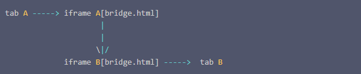

## 跨标签页通信

2. localStorage 通过 setItem 发送消息，通过监听 storage 事件获取消息，只支持同源页面。
3. url 传参，适用于在 A 页面打开 B 页面的情况。
4. postMessage A 页面通过 window.open 获取 B 页面的句柄。通过 bWindow.postMessage 传递数据，在 B 页面通过 onmessage 获取 A 页面传递的参数，也可以通过 e.source.postMessage 传递信息给 A 页面。允许跨域通信。
5. BroadcastChannel 可以帮我们创建一个用于广播的通信频道。当所有页面都监听同一频道的消息时，其中某一个页面通过它发送的消息就会被其他所有页面收到，兼容性较差。
```js
const bc = new BroadcastChannel('AlienZHOU');
bc.onmessage = function (e) {
    const data = e.data;
    const text = '[receive] ' + data.msg + ' —— tab ' + data.from;
    console.log('[BroadcastChannel] receive message:', text);
};
bc.postMessage(mydata);
```
6. 两个互不相关的tab页面通信

- tab A中嵌入iframe A，tab B中嵌入iframe B
- 这两个iframe引用相同的页面“bridge.html”。
- 如果tab A发消息给tab B，首先tab A通过postMessage消息发送给iframe A（tab A可以获取到iframe A的window对象iframe.contentWindow）
- 此后iframe A通过storage消息完成与iframe B的通信（由于iframeA 与iframe B同源，因此localstorage的通信方式这里可以使用）
- 最终，iframe B同样采用postMessage方式发送消息给tab B（在iframe中通过window.parent引用tab B的window对象）。
- 至此，tab A的消息走通了所有链路，成功抵达tab B。

```js
tab A:

// 向弹出的tab页面发送消息
window.sendMessageToTab = function(data){
    // 由于[#J_bridge]iframe页面的源文件在vstudio服务器中，因此postMessage发向“同源”
    document.querySelector('#J_bridge').contentWindow.postMessage(JSON.stringify(data),'/');
};

// 接收来自 [#J_bridge]iframe的tab消息
window.addEventListener('message',function(e){
    let {data,source,origin}  = e;
    if(!data)
        return;
    try{
        let info = JSON.parse(JSON.parse(data));
        if(info.type == 'BSays'){
           console.log('BSay:',info);
        }
    }catch(e){
    } 
});

sendMessageToTab({
    type: 'ASays',
    data: 'hello world, B'
})


bridge.html

window.addEventListener("storage", function(ev){
    if (ev.key == 'message') {
        window.parent.postMessage(ev.newValue,'*');
    }
});

function message_broadcast(message){
    localStorage.setItem('message',JSON.stringify(message));
    localStorage.removeItem('message');
}

window.addEventListener('message',function(e){
    let {data,source,origin}  = e;
    // 接受到父文档的消息后，广播给其他的同源页面
    message_broadcast(data);
});


tab B

window.addEventListener('message',function(e){
    let {data,source,origin}  = e;
    if(!data)
        return;
    let info = JSON.parse(JSON.parse(data));
    if(info.type == 'ASays'){
        document.querySelector('#J_bridge').contentWindow.postMessage(JSON.stringify({
            type: 'BSays',
            data: 'hello world echo from B'
        }),'*');
    }
});

// tab B主动发送消息给tab A
document.querySelector('button').addEventListener('click',function(){
    document.querySelector('#J_bridge').contentWindow.postMessage(JSON.stringify({
        type: 'BSays',
        data: 'I am B'
    }),'*');
})
```