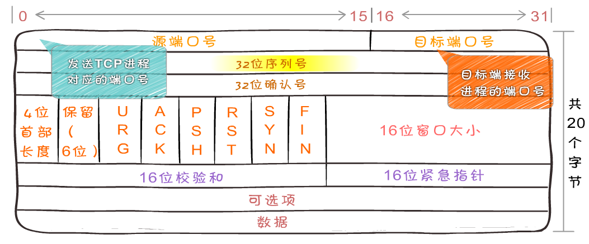

## OSI 七层模型
- 应用层(Application) 提供网络与用户应用软件之间的接口服务
- 表示层(Presentation) 提供格式化的表示和转换数据服务，如加密和压缩
- 会话层(Session) 提供包括访问验证和会话管理在内的建立和维护应用之间通信的机制
- 传输层(Transimission) 提供建立、维护和取消传输连接功能，负责可靠地传输数据(PC)
- 网络层(Network) 处理网络间路由，确保数据及时传送(路由器)
- 数据链路层(DataLink) 负责无错传输数据，确认帧、发错重传等(交换机)
- 物理层(Physics) 提供机械、电气、功能和过程特性(网卡、网线、双绞线、同轴电缆、中继器)

## TCP/IP 模型
- 应用层 HTTP FTP DNS
- 传输层 TCP UDP 提供端到端的连接
- 网络层 IP 提供路由和寻址的功能，使两终端系统能够互连且决定最佳路径。
- 数据链路层
  - 物理层传输数据时会不可避免的产生误差。
  - 数据链路层在物理层之上，将物理层传输的数据组合成数据帧(Frame)。
  - 用差错检测、差错控制和流量控制等方法，向网络层提供高质量的数据传输服务。
- 物理层 为数据传输提供可靠的传输环境进行数据传输

## TCP 
- 面向连接的可靠的传输层协议，传输效率低。
- 将数据进行分段打包传输
- 对每个数据包编号控制顺序
- 运输中丢失、重发和丢弃处理
- 流量控制避免拥塞

### TCP 数据包

1. 源端口号和目标端口号，计算机通过端口号识别访问哪个服务。
2. 32位序列号
   1. 通过序列号对数据包进行标记，到达目的地之后通过序列号重组数据
   2. 当前的序列号为 s，发送数据长度为 l，则下次发送数据时的序列号为 s + l
   3. 建立连接时通常由计算机生成一个随机数作为序列号的初始值
3. 确认应答号
   1. 它等于下一次应该接收到的数据的序列号
   2. 发送端的序列号为 s，发送数据的长度为 l，那么接收端返回的确认应答号也是 s + l。
   3. 发送端接收到这个确认应答后，可以认为这个位置以前所有的数据都已被正常接收。
4. 首部长度
   1. 标识 TCP 的首部长度
5. 控制位 TCP的连接、传输和断开都受这六个控制位的指挥
   1. PSH(push急迫位) 缓存区将满，立刻降低传输速度
   2. RST(reset重置位) 连接断了重新连接
   3. URG(urgent紧急位) 紧急信号
   4. ACK(acknowledgement 确认)为1表示确认号
   5. SYN(synchronous建立联机) 同步序号位 TCP建立连接时要将这个值设为1
   6. FIN发送端完成位，提出断开连接的一方把FIN置为1表示要断开连接
6. 紧急指针
   1. 在 URG(urgent紧急) 控制位为 1 时有效
   2. 通常在暂时中断通信时使用
7. 窗口值 
   1. 说明本地可接收数据段的数目，这个值的大小是可变的。
   2. 当网络通畅时将这个窗口值变大加快传输速度。
   3. 当网络不稳定时减少这个值可以保证网络数据的可靠传输。
   4. 它是来在TCP传输中进行流量控制的
8. 校验和
   1. 用来做差错控制
   2. 发送TCP数据段时，由发送端计算校验和
   3. 到达目的地时又进行一次检验和计算。
   4. 如果两次校验 和一致说明数据是正确的，否则 将认为数据被破坏，接收端将丢弃该数据
   
## UDP 
- 无连接的不可靠的传输层协议，传输效率高
- 发送端不关心发送的数据是否到达目标主机、数据是否出错。
- 收到数据的主机也不会告诉 发送方是否收到了数据。
- 它的可靠性由上层协议来保障